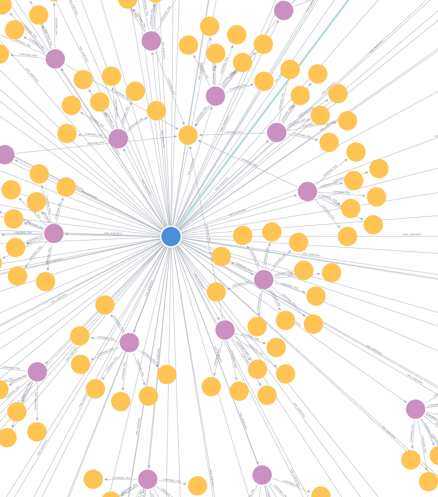
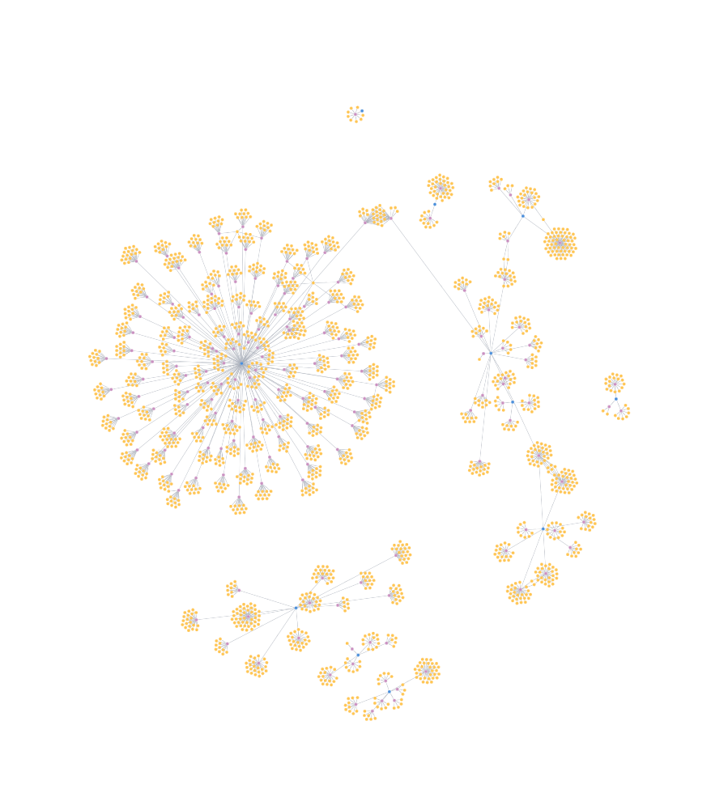

# Jio FAQ Chatbot

An intelligent, multi-modal FAQ assistant for Jio.com support queries. Combines **Neo4j graph database** with **hybrid search (vector + fulltext)**, **CrossEncoder reranking**, and **LLM-powered generation** (Ollama Gemma-2-2B / Local LLMs). Features **speech-to-text**, **text-to-speech** (Sarvam AI), **live video/audio chat** with vision understanding, **PDF ingestion** (Qdrant), **image generation**, and **persistent user memory** (Supabase). Served via FastAPI with a React + Vite web frontend and a robust **React Native Expo mobile app** featuring **on-device Local LLM inference (Gemma 2B)** for ultra-low latency.

---

## Architecture

```
┌─────────────────────────────────────────────────────────────┐
│                           Clients                           │
│  ┌────────────────────┐  ┌────────────────────┐             │
│  │ React/Vite Web App │  │ React Native Expo  │             │
│  └─────────┬──────────┘  └─────────┬──────────┘             │
└────────────┼───────────────────────┼────────────────────────┘
             │ HTTP/REST + WS        │ HTTP + WS
             ▼                       ▼
┌─────────────────────────────────────────────────────────────┐
│                  FastAPI Backend (server.py)                  │
│                                                              │
│  REST Endpoints:                WebSocket Endpoints:         │
│  POST /api/chat                 WS /api/live/ws              │
│  POST /api/chat/audio           WS /api/audio_stream/ws      │
│  GET  /api/sessions                                            │
│  GET  /api/sessions/{id}/history                               │
│  DELETE /api/sessions/{id}                                     │
│  POST /api/upload (PDF)                                        │
│  GET  /api/memory                                              │
│  POST /api/vision                                              │
│  POST /api/generate_image                                      │
│                                                              │
│  ┌──────────────────────────────────────────────────────┐    │
│  │  LangGraph Workflow (app.py → nodes.py)              │    │
│  │                                                      │    │
│  │  retrieve_node: Neo4j vector + fulltext → Qdrant    │    │
│  │                → CrossEncoder rerank → route        │    │
│  │  generate_node: Gemma 2B (Ollama Local LLM)         │    │
│  │  general_generation_node: Gemma 2B (Ollama) + tools │    │
│  └──────────────────────────────────────────────────────┘    │
└──────────┬──────────┬──────────┬──────────┬──────────────────┘
           │          │          │          │
           ▼          ▼          ▼          ▼
      Supabase     Neo4j      Qdrant     Sarvam AI
      (Auth +     (FAQ       (User       (STT/TTS)
       Memory)     Graph)     Docs)
```

---

## Output Inference Optimization

To achieve ultra-low latency and a smooth user experience, several inference optimizations are implemented:
- **Time to First Token (TTFT) Tracking**: Focused on bringing TTFT down to <100ms for autocomplete and <500ms for chat UI. Streaming tokens locally via `llama.rn` are essential to maintain an uninterrupted conversational flow.
- **KV Cache Optimization**: State caching handles multi-turn interactions, significantly reducing TTFT on subsequent requests (warm starts vs. cold starts) by keeping the context loaded in memory.
- **On-Device Execution**: The mobile app runs `Gemma 2B` via `llama.rn` locally on the device's hardware. This entirely eliminates network overhead and prioritizes privacy-first zero-latency generation.
- **Vision Prefilling for Realtime Video Chat**: Qwen Vision (a reasoning model) defaults to outputting `<think>` tags, delaying the actual response. We optimize this by forcibly prefilling the API response with `{"description": "`, bypassing the reasoning phase and slashing vision latency from >22s to <5s.
- **Intelligent Scene Change Detection**: For live video chat, we avoid redundant LLM vision calls using multi-region MD5 hashing. The camera frame is divided into 3 regions (top, mid, bottom), and the vision model is only triggered if at least 2 out of 3 regions change, ignoring minor localized movements.
- **Concurrent Processing**: Parallelizing tasks such as background STT/TTS fetching, LangGraph RAG retrievals, and memory updates out of the critical inference path ensures that model prefill and decode speeds remain the sole bottlenecks.

---

## Features

### Core
- **Hybrid RAG Pipeline** — Vector similarity (`all-MiniLM-L6-v2`) + Lucene fulltext search on Neo4j, reranked by CrossEncoder (`ms-marco-MiniLM-L-6-v2`)
- **Multi-LLM Architecture** — **Local Gemma-2-2B via Ollama** for LangGraph RAG pipeline and low-latency live streaming; and **On-Device Local LLM (Gemma-2-2B)** in the mobile app for privacy-first, ultra-fast generation.
- **Live Video Chat** — Full-duplex WebSocket with camera frames (0.5 FPS), Silero VAD, vision LLM (**Qwen Vision**), and streaming TTS
- **Live Audio Chat** — Streaming WebSocket with Sarvam STT → RAG retrieval → Local Gemma-2-2B streaming LLM → parallel Sarvam TTS
- **Long-Term Memory** — Persisted user facts in Supabase `user_memory` table, injected into every LLM call
- **Short-Term Memory** — LangGraph checkpointing via SQLite (`checkpoints.db`) for conversation history per session

### Multi-Modal
- **Speech-to-Text** — Sarvam AI `saaras:v3` (Hinglish codemix, Silero VAD silence detection)
- **Text-to-Speech** — Sarvam AI `bulbul:v3` streaming with sentence-boundary parallel fetching
- **Vision (Upload)** — Analyze uploaded images via Qwen Vision
- **Image Generation** — Cloudflare Workers AI Flux (text-to-image)
- **PDF Ingestion** — Upload PDFs → Docling conversion → chunking → Qdrant vector storage → per-user retrieval

### UI
- **Web Frontend** — React + Vite with text, audio, voice, and live video modes
- **Mobile App** — React Native Expo featuring **On-Device Local LLM inference via llama.rn**, camera preview, VAD barge-in, and TTS queue
- **A2UI Cards** — LLM can embed rich UI components (e.g., WeatherCard) in responses

---

## Tech Stack

| Layer | Technology |
|---|---|
| **Language** | Python 3.10+ |
| **Backend Framework** | FastAPI + Uvicorn |
| **Agent Framework** | LangGraph, LangChain |
| **FAQ LLM** | Ollama Gemma 2 2B (`cow/gemma2_tools:2b`) |
| **Streaming LLM** | Ollama Gemma 2 2B (`cow/gemma2_tools:2b`) |
| **Vision LLM** | Qwen Vision (`qwen-vision`) |
| **Local Mobile LLM** | Gemma 2 2B (`gemma-2-2b-it.gguf` via `llama.rn`) |
| **Graph Database** | Neo4j (Docker, `bolt://localhost:7687`) |
| **Vector Store (FAQ)** | Neo4j vector index (`faq_embeddings`) |
| **Vector Store (Docs)** | Qdrant Cloud (`jio_documents` collection) |
| **Embedding** | `all-MiniLM-L6-v2` (SentenceTransformers) |
| **Reranking** | `cross-encoder/ms-marco-MiniLM-L-6-v2` |
| **STT** | Sarvam AI `saaras:v3` |
| **TTS** | Sarvam AI `bulbul:v3` (speaker: `shubh`) |
| **VAD** | Silero VAD |
| **Auth + Memory** | Supabase (JWT, `user_memory`, `chat_sessions`) |
| **Image Gen** | Cloudflare Workers AI (`@cf/black-forest-labs/flux-1-schnell`) |
| **Checkpointing** | SQLite (`checkpoints.db`) via LangGraph `AsyncSqliteSaver` |
| **Web Frontend** | React + Vite |
| **Mobile** | React Native + Expo (SDK 54) |

---

## Project Structure

```
├── server.py              # FastAPI server (REST + WebSocket endpoints)
├── app.py                 # LangGraph workflow definition
├── nodes.py               # LangGraph nodes (retrieve, generate, general)
├── agent_state.py         # GraphState TypedDict
├── tools.py               # LangChain tools (weather, location)
├── get_transcript.py      # Sarvam STT (WebSocket streaming + REST)
├── get_audio.py           # Sarvam TTS (async streaming)
├── file_workflow.py       # PDF ingestion (Docling → Qdrant)
├── clear_memory.py        # Utility to clear Supabase user_memory
├── checkpoints.db         # SQLite LangGraph checkpoints
│
├── frontend/              # Web app (React + Vite)
│   └── src/
│       ├── App.jsx        # Main chat UI (all modes)
│       ├── Auth.jsx       # Supabase login/signup
│       ├── A2UICatalog.tsx # Weather card component
│       ├── supabaseClient.js
│       └── fillersData.js # Pre-generated TTS fillers
│
├── mobile_app/            # Mobile app (React Native + Expo)
│   └── src/
│       ├── app/(app)/
│       │   ├── chat.tsx   # Text + voice chat screen
│       │   └── live.tsx   # Live video chat screen
│       └── services/
│           └── api.ts     # API client
│
├── data/
│   ├── jio_faq_data.json  # Scraped FAQ dataset
│   └── topics.json        # Topic hierarchy
│
└── .env                   # API keys
```

---

## Setup & Recreation Guide

This guide is designed for anyone (including your future self) to easily recreate, set up, and run this project from scratch. It covers model requirements, environment variables, connecting the Vision and Local LLMs, and building the mobile app.

### 1. Prerequisites & Terminals Needed

To fully run the project (Backend, Web Frontend, and Mobile App), you will need to open **4 separate terminal windows**.

Ensure you have installed:
- **Python 3.10+**
- **Node.js 18+**
- **Docker** (for running the Neo4j database)
- **Ollama** (for local LLM inference)

### 2. LLM Models Required

This project relies on both backend LLMs and an on-device mobile LLM.

#### A. Backend Models (Ollama)
Install Ollama on your machine and download the required models. In your terminal, run:
```bash
# Main generation and routing LLM
ollama pull cow/gemma2_tools:2b

# Vision LLM (for analyzing images and live video chat)
ollama pull qwen-vision
```

#### B. Mobile On-Device Model (LiteRT)
The mobile app uses Google's LiteRT for native hardware acceleration. 
- You need the **Gemma 2B LiteRT model** (e.g., `gemma4-E2B-it.litertlm`).
- **Where to put it:** Place this `.litertlm` (or `.task`) file in the `public/` directory of your backend so the mobile app can download it on its first run.
- **Path:** `public/gemma4-E2B-it.litertlm`

### 3. Environment Variables (`.env`)

Create a `.env` file in the root directory (`/Users/amanpausker/jio_faq_chatbot/.env`). Here is the template with the necessary API keys you'll need to gather:

```env
# 1. Local LLM Configuration
# If testing mobile on a real device, change localhost to your machine's local IP (e.g. 192.168.1.x)
OLLAMA_BASE_URL="http://localhost:11434"

# 2. Sarvam AI (For Speech-to-Text and Text-to-Speech)
SARVAM_API_KEY="your_sarvam_api_key_here"

# 3. Supabase (For Auth and User Memory)
VITE_SUPABASE_URL="https://your-project-id.supabase.co"
VITE_SUPABASE_ANON_KEY="your_supabase_anon_key_here"
supabase_project_password="your_database_password_here"

# 4. Qdrant (For PDF Ingestion and Retrieval)
QDRANT_URL="https://your-qdrant-cluster-url"
QDRANT_API_KEY="your_qdrant_api_key_here"

# 5. Cloudflare Workers AI (For Image Generation - Flux)
CLOUDFARE_ACCOUNT_ID="your_cloudflare_account_id"
WORKERS_API_KEY="your_cloudflare_workers_api_key"

# 6. OpenWeather (For Weather Tool integration)
OPEN_WEATHER_API_KEY="your_openweather_api_key"
```
*Note: The FastAPI backend will automatically use `OLLAMA_BASE_URL` to connect to both your local text LLM and the Qwen Vision model.*

### 4. Step-by-Step Execution Guide

#### Terminal 1: Database & Backend
1. **Start Neo4j via Docker**:
   ```bash
   docker run -d --name neo4j -p 7687:7687 -p 7474:7474 \
     -e NEO4J_AUTH=neo4j/password123 \
     -e NEO4J_apoc_export_file_enabled=true \
     -e NEO4J_apoc_import_file_enabled=true \
     -e NEO4J_apoc_import_file_use__neo4j__config=true \
     neo4j:latest
   ```
2. **Setup Python Environment & Install Requirements**:
   ```bash
   python -m venv venv
   source venv/bin/activate
   pip install -r requirements.txt
   ```
3. **Seed Database (Only on first setup)**:
   ```bash
   python load_to_graph.py
   python embed_faqs.py
   python create_index.py
   ```
4. **Run the Backend Server**:
   ```bash
   uvicorn server:server --host 0.0.0.0 --port 8000
   ```
   *(Running on `0.0.0.0` allows your mobile phone to connect to the backend).*

#### Terminal 2: Web Frontend
```bash
cd frontend
npm install
npm run dev
```

#### Terminal 3: Mobile App (APK Generation & Running)

Because the mobile app uses a custom Kotlin Native Module for LiteRT, **Expo Go will not work**. You must build a native app (APK for Android).

1. **Install dependencies**:
   ```bash
   cd mobile_app
   npm install
   ```

2. **Generate and Install the APK directly to a connected Android Device / Emulator**:
   ```bash
   npx expo run:android
   ```
   *This command compiles the native Android code (including LiteRT dependencies) and installs the `app-debug.apk` directly onto your connected device.*

3. **Alternative: Build a standalone APK using EAS (Expo Application Services)**:
   If you want an APK file to share with others:
   ```bash
   npm install -g eas-cli
   eas login
   eas build -p android --profile preview
   ```
   *This will generate a download link for the `.apk` file once the cloud build is finished.*

### 5. Connecting the Mobile App & Vision Model

- **Vision Model Connectivity**: The backend (`server.py`) natively talks to `qwen-vision` using the `OLLAMA_BASE_URL`. Ensure Ollama is running (`ollama serve`). 
- **Mobile to Backend Connectivity**: When running the mobile app on a physical device, it needs to know your computer's local IP address to connect to the FastAPI server and Ollama. 
  1. Find your machine's local IP (e.g., `192.168.1.5`).
  2. In your mobile app's API client (e.g., `mobile_app/src/services/api.ts`), ensure the backend URL points to `http://192.168.1.5:8000` instead of `localhost`.
  3. Update `.env` `OLLAMA_BASE_URL` to `http://192.168.1.5:11434` if the mobile app queries it directly.

---

## Usage

### Web App
Navigate to `http://localhost:5173` (Vite dev server).

- **Text chat** — Type a message and press Enter
- **Audio chat** — Hold-to-talk button → VAD auto-detection → Sarvam STT → LLM → TTS
- **Voice mode** — Continuous voice chat with animated orb
- **Live video** — Camera + mic streaming with real-time vision understanding
- **PDF upload** — Drag-and-drop a PDF for Qdrant-based retrieval
- **Image upload** — Upload for vision analysis
- **Image generation** — Text prompt → Flux AI
- **Session management** — Sidebar with chat history

### Mobile App
Scan the Expo QR code or run on a simulator.

- **Text/voice chat** — `chat.tsx` with continuous VAD, push-to-talk, and **Local LLM integration (Gemma 2B)**
- **Live video chat** — `live.tsx` with camera preview, TTS queue, and barge-in

### API

```bash
# Text chat
curl -X POST "http://localhost:8000/api/chat" \
  -H "Authorization: Bearer <supabase_jwt>" \
  -H "Content-Type: application/json" \
  -d '{"message": "How do I recharge my Jio plan?", "session_id": "optional-uuid"}'

# Audio chat
curl -X POST "http://localhost:8000/api/chat/audio" \
  -H "Authorization: Bearer <supabase_jwt>" \
  -F "audio=@recording.wav" \
  -F "session_id=optional-uuid"

# WebSocket live video chat
ws://localhost:8000/api/live/ws

# WebSocket audio stream chat
ws://localhost:8000/api/audio_stream/ws
```

---

## Context Management

Context bloat is actively managed using dual-tiered memory to ensure ultra-low latency inference while maintaining deep contextual awareness.

### Long-Term Memory (LTM)
LTM persists user-specific facts (e.g., plan details, preferences) across sessions to provide a highly personalized experience.
- **Storage**: Saved persistently in Supabase's `user_memory` table.
- **Mechanism**: A background task (`evaluate_and_save_memory_bg`) runs after conversations to evaluate and extract newly learned facts.
- **Retrieval**: Before every LLM generation, `fetch_user_memories` fetches the user's facts from Supabase and injects them directly into the system prompt.

### Short-Term Memory (STM)
STM handles the immediate conversational history for the current session.
- **Storage**: Managed by LangGraph state and backed by SQLite (`checkpoints.db`).
- **Mechanism**: To prevent context bloat when the conversation grows, a background task (`summarize_short_term_memory_bg`) automatically summarizes older messages. The old messages are pruned (using LangGraph's `RemoveMessage`), and the condensed summary is injected into the state, keeping the LLM prompt concise and fast.

### Ephemeral Session State
- **Storage**: Handled in-memory via `ConnectionManager`.
- **Mechanism**: Manages transient state for live video/audio WebSocket connections, with a 600-second TTL.

---

## Data Pipeline

1. **FAQ Scraping** — `data/jio_faq_data.json` (200+ entries covering True 5G, Postpaid, International Roaming, Offers, Onboarding)
2. **Graph Ingestion** — `load_to_graph.py` creates `Topic` → `Subtopic` → `FAQ` nodes in Neo4j
3. **Embeddings** — `embed_faqs.py` generates vectors via `all-MiniLM-L6-v2` (~90MB local model)
4. **Fulltext Index** — `create_index.py` builds Lucene index on FAQ `question` + `answer` fields
5. **PDF Ingestion** — `POST /api/upload` → Docling → chunking (1000 chars, 200 overlap) → Qdrant

### Neo4j Graph Database Schema
The Neo4j graph represents the relationships between `Topic`, `Subtopic`, and `FAQ` nodes, enabling highly accurate contextual hybrid retrieval.




---

## Latency Goals

| Stage | Target | Actual (typical) |
|---|---|---|
| STT | <1s | 300-800ms |
| RAG Retrieval | <500ms | 300-800ms |
| LLM first token (Groq) | <50ms | 30-80ms |
| LLM first token (NVIDIA) | <1s | 500-2000ms |
| Vision LLM | 2-4s | 2-4s |
| TTS first chunk | <500ms | 300-800ms |
| Total (FAQ text) | <5s | 2-5s |
| Total (live video) | <7s | 3-7s |

---

## License

This project is for demonstration purposes. FAQ data belongs to Jio.com.
