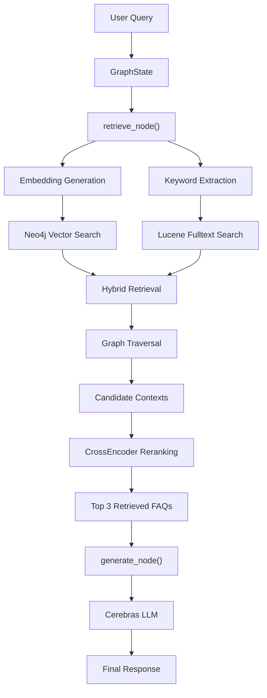

# Jio FAQ Chatbot

An intelligent, context-aware FAQ assistant for Jio.com support queries. Combines a **Neo4j graph database** with **hybrid search (vector + fulltext)**, **CrossEncoder reranking**, and **LLM-powered generation** via Cerebras (Llama 3.1 8B). Features **speech-to-text** and **text-to-speech** capabilities powered by Sarvam AI, all wrapped in a Gradio web UI.

## Architecture

```
User (Text or Audio)
    |
    v
[Gradio UI]
    |
    +--- Text ----> retrieve_node()
    |                   |
    |               [Fuzzy Normalizer]
    |               (jellyfish + difflib)
    |                   |
    |          +--------+--------+
    |          |                 |
    |     [Vector Search]   [Keyword + Fulltext]
    |     (Neo4j, top 10)  (Neo4j Lucene, top 10)
    |          |                 |
    |          +--------+--------+
    |                   |
    |           [Graph Traversal]
    |           (Topic -> Subtopic -> FAQ)
    |                   |
    |           [CrossEncoder Rerank]
    |           (top 3 contexts)
    |                   |
    |             generate_node()
    |                   |
    |            [Cerebras Llama 3.1 8B]
    |                   |
    +--- Audio --------> listen_for_speech()
    |                   (Sarvam STT)
    |                   |
    |              [Transcript]
    |                   |
    |              (same pipeline)
    |
    v
[Answer] ----> generate_speech() (Sarvam TTS) ----> Audio playback
```

### LangGraph Workflow



## Features

- **Hybrid Search Pipeline**: Vector similarity search (all-MiniLM-L6-v2 embeddings) combined with Lucene fulltext search for high precision and recall.
- **Fuzzy Query Normalization**: Phonetic (jellyfish) and string-similarity (difflib) correction for ASR typos (e.g., "siggy" -> "Swiggy", "geo" -> "Jio").
- **CrossEncoder Reranking**: ms-marco-MiniLM-L-6-v2 scores candidate contexts to surface the top 3 most relevant FAQs.
- **Graph Traversal**: Neo4j Cypher queries walk `(Topic)-[:HAS_SUBTOPIC]->(Subtopic)-[:CONTAINS_FAQ]->(FAQ)` to build rich context strings.
- **Speech-to-Text**: Real-time microphone streaming via Sarvam AI WebSocket API (saaras:v3, Hindi codemix).
- **Text-to-Speech**: Asynchronous chunked TTS via Sarvam AI REST API (bulbul:v3) with proper WAV stitching.
- **Latency Optimized**: End-to-end response time under 5 seconds (down from 60s).
- **Gradio Web UI**: Accessible chat interface with audio recording and playback.

## Tech Stack

| Layer              | Technology                                                                 |
|--------------------|----------------------------------------------------------------------------|
| Language           | Python 3.10+                                                               |
| UI                 | Gradio                                                                     |
| Agent Framework    | LangGraph, LangChain                                                       |
| LLM                | Cerebras (Llama 3.1 8B)                                                    |
| Vector Search      | Neo4j vector index + sentence-transformers (all-MiniLM-L6-v2)              |
| Fulltext Search    | Neo4j Lucene fulltext index                                                |
| Reranking          | CrossEncoder (ms-marco-MiniLM-L-6-v2)                                     |
| Graph Database     | Neo4j (Docker)                                                             |
| Speech-to-Text     | Sarvam AI WebSocket API (saaras:v3)                                        |
| Text-to-Speech     | Sarvam AI REST API (bulbul:v3)                                             |
| Fuzzy Matching     | jellyfish, difflib                                                         |

## Project Structure

```
├── app.py                    # Main entry point (Gradio UI + LangGraph workflow)
├── agent_state.py            # TypedDict graph state definition
├── nodes.py                  # LangGraph nodes: retrieve_node, generate_node
├── get_transcript.py         # Speech-to-Text via Sarvam AI streaming
├── get_audio.py              # Text-to-Speech via Sarvam AI (async chunked)
├── embed_faqs.py             # Generates & stores embeddings in Neo4j
├── create_index.py           # Creates Neo4j fulltext index
├── jio_faq_data.json         # Scraped FAQ data (topic, sub_topic, Q&A)
├── topics.json               # Topic -> sub-topic hierarchy mapping
├── profile_latency.py        # End-to-end latency profiling
├── check_sarvam.py           # Sarvam TTS WebSocket test
├── test_*.py                 # Unit/performance test scripts
├── speech_to_text_demo/      # Standalone Sarvam AI demos
│   ├── demo.py               # Batch STT job demo
│   ├── demo_audio_streaming.py # Live mic streaming demo
│   └── demo_tts.py           # TTS streaming demo
└── .env                      # Environment variables (API keys)
```

## Setup

### Prerequisites

- Python 3.10+
- [Docker](https://www.docker.com/) (for Neo4j)
- API keys for Cerebras and Sarvam AI

### 1. Clone & Virtual Environment

```bash
git clone https://github.com/AmanPausker/Demo_Jio.com_faq_chatbot.git
cd Demo_Jio.com_faq_chatbot

python -m venv venv
source venv/bin/activate  # Windows: venv\Scripts\activate
```

### 2. Install Dependencies

```bash
pip install neo4j sentence-transformers langchain-cerebras langchain-core \
            python-dotenv gradio langgraph langchain-community \
            sounddevice numpy jellyfish
```

### 3. Start Neo4j (Docker)

```bash
docker run -d --name neo4j -p 7687:7687 -p 7474:7474 \
  -e NEO4J_AUTH=neo4j/password123 \
  -e NEO4J_apoc_export_file_enabled=true \
  -e NEO4J_apoc_import_file_enabled=true \
  -e NEO4J_apoc_import_file_use__neo4j__config=true \
  neo4j:latest
```

Access Neo4j Browser at `http://localhost:7474` (credentials: `neo4j` / `password123`).

### 4. Environment Variables

Create a `.env` file in the project root:

```env
CEREBRAS_API_KEY="your_cerebras_api_key_here"
SARVAM_API_KEY="your_sarvam_api_key_here"
```

### 5. Build the Database

Run in order:

```bash
# (Optional) Load FAQ data into Neo4j graph
python load_to_graph.py

# Generate and store vector embeddings
python embed_faqs.py

# Create Lucene fulltext index
python create_index.py
```

> **Note**: `jio_faq_data.json` is pre-populated with scraped FAQ data. If you need to re-scrape, use `python collection_data.py`.

### 6. Run the Chatbot

```bash
python app.py
```

Open the Gradio URL (default `http://localhost:7860`) in your browser.

## Usage

- **Text queries**: Type your question and press Enter.
- **Audio queries**: Click the microphone button, speak, and stop. The audio is transcribed via Sarvam STT and processed through the same pipeline.
- **Responses**: The answer is displayed as text and also played as speech (Sarvam TTS).

## Testing

Test scripts are standalone Python files (no framework dependency):

```bash
python test_neo4j_fuzzy.py     # Neo4j fulltext + fuzzy search
python test_chunking.py        # Async chunked TTS stitching
python test_chunking_wave.py   # Chunked TTS with WAV headers
python test_models.py          # Sarvam v2 vs v3 TTS speed comparison
python test_rest.py            # Sarvam REST TTS API latency
python test_sarvam_latency.py  # End-to-end TTS latency
python test_truncation.py      # Long text truncation behavior
python check_sarvam.py         # Sarvam TTS WebSocket streaming
```

## Profiling

```bash
python profile_latency.py
```

Measures per-stage latency: retrieval (Neo4j + CrossEncoder), generation (Cerebras), TTS (Sarvam), and total end-to-end.

## Data Pipeline

1. **Extraction**: FAQ data is scraped from Jio.com's official support pages and compiled into `jio_faq_data.json`.
2. **Graph Ingestion**: `load_to_graph.py` creates `Topic`, `Subtopic`, and `FAQ` nodes with `HAS_SUBTOPIC` and `CONTAINS_FAQ` relationships in Neo4j.
3. **Embeddings**: `embed_faqs.py` generates vector embeddings using `all-MiniLM-L6-v2` (local, ~90MB) and stores them directly on Neo4j nodes.
4. **Indexing**: `create_index.py` builds a Lucene fulltext index on FAQ `question` and `answer` fields.

## Intelligent Hybrid Search

The retrieval pipeline combines three complementary strategies:

1. **Vector Search**: Encodes the query with `all-MiniLM-L6-v2` and retrieves top 10 semantically similar FAQs from Neo4j's vector index.
2. **Fulltext Search**: Extracts key phrases from the query (after stopword removal and brand expansion) and performs a Lucene `OR`-joined fulltext search for top 10 results.
3. **Reranking**: Both result sets are merged, deduplicated, and scored by a CrossEncoder (`ms-marco-MiniLM-L-6-v2`). The top 3 contexts are passed to the LLM.

This ensures the LLM receives both semantically relevant and keyword-exact context — critical for niche or highly specific FAQ topics.

## License

This project is for demonstration purposes. All FAQ data belongs to Jio.com.
