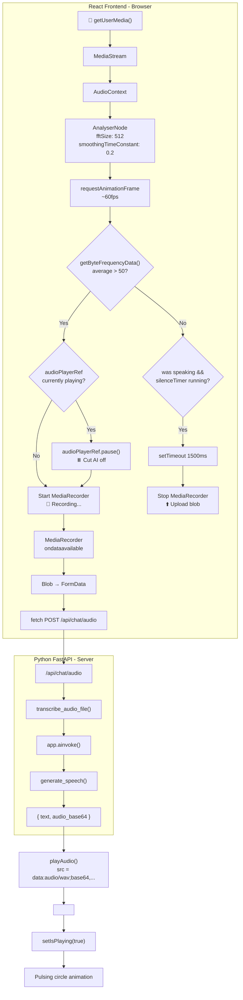
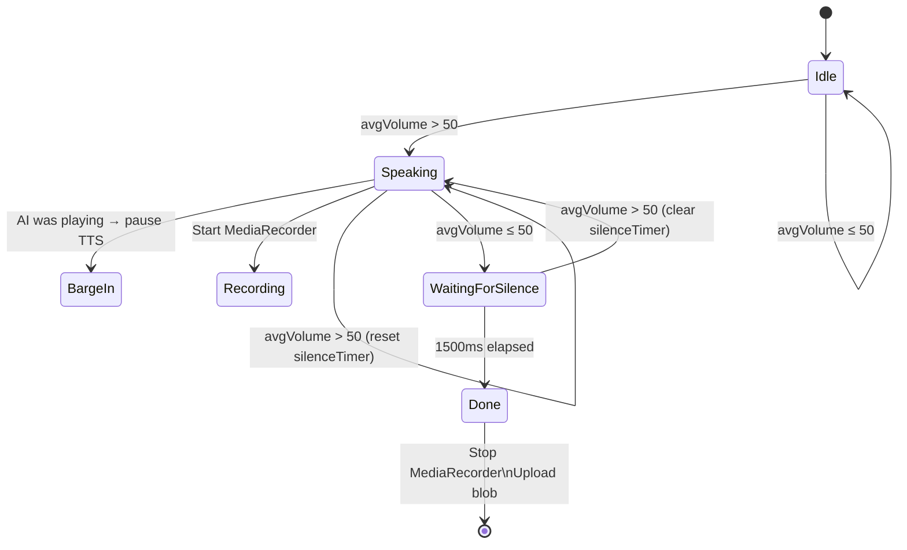
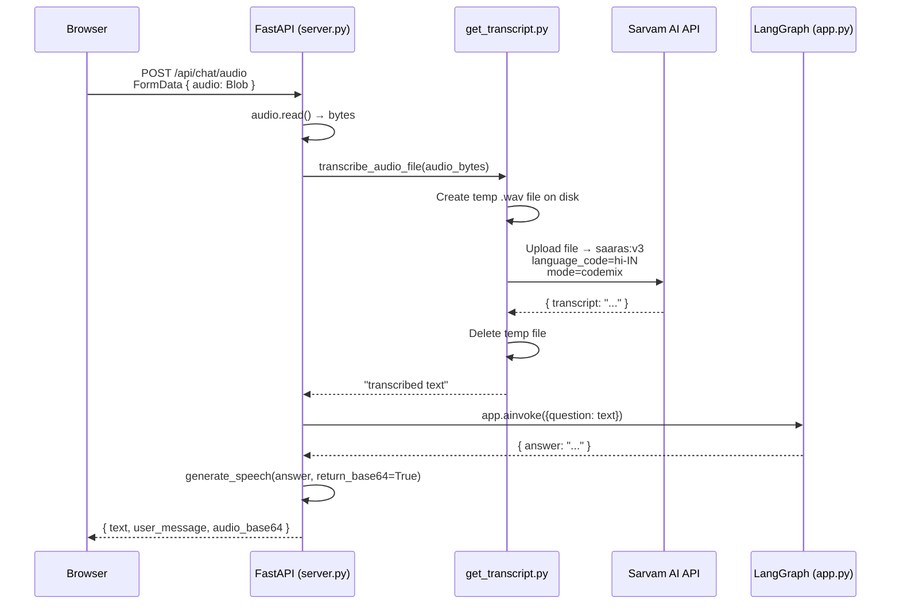
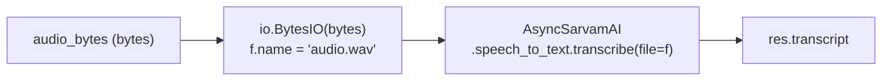
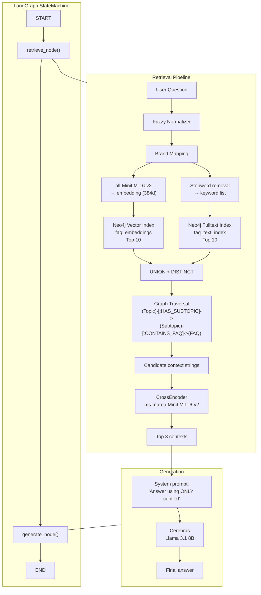
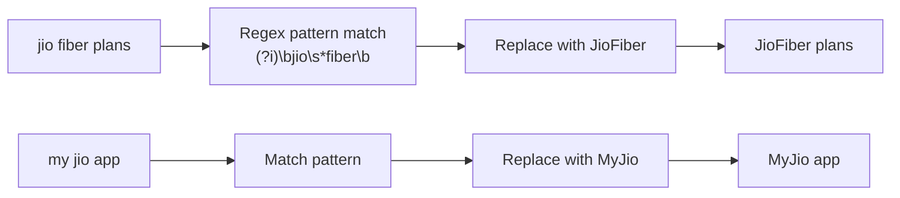
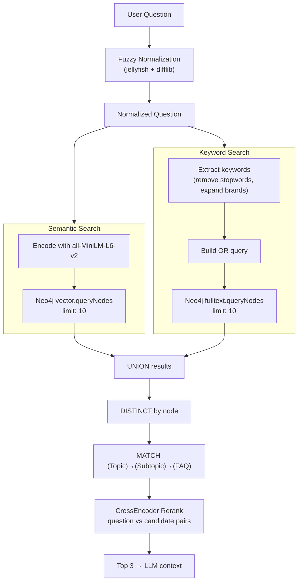
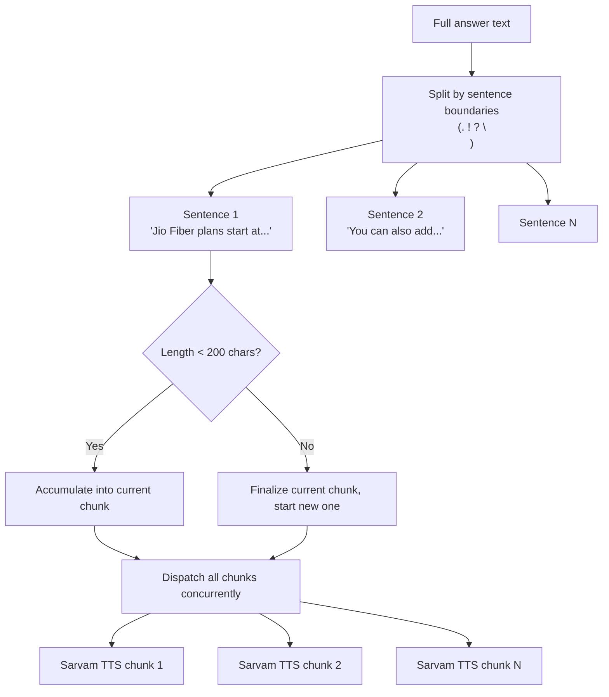
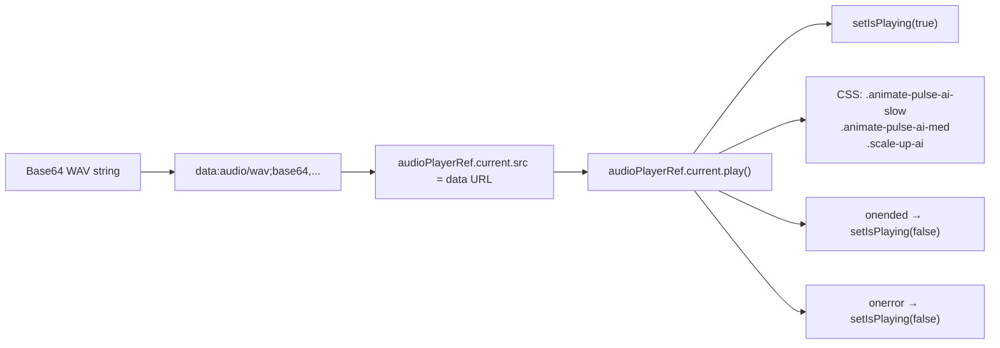
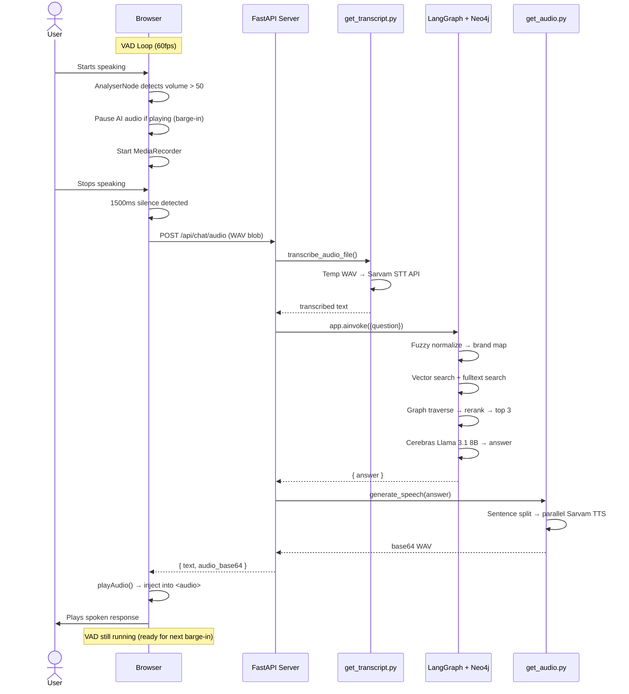

# Architecture — Key Implementations

## 1. Voice Activity Detection (VAD) & Barge-in

**File**: `frontend/src/App.jsx` — `startNativeVAD()` (line 175)

Uses the **Web Audio API** (`AnalyserNode`) to read raw frequency-domain volume levels 60 times a second. No ML model runs in the browser — it is a simple energy-based VAD.

### Architecture



### VAD State Machine



### Key Parameters

| Parameter | Value | Purpose |
|-----------|-------|---------|
| `fftSize` | 512 | Frequency resolution for AnalyserNode |
| `smoothingTimeConstant` | 0.2 | Light smoothing — responsive to speech onset |
| `VOLUME_THRESHOLD` | 50 | High threshold to reject background noise |
| `SILENCE_MS_TO_STOP` | 1500ms | Confirm user finished speaking |
| Poll rate | ~60fps (rAF) | Real-time volume checks |

### Barge-in Flow

```
User starts speaking while AI is playing TTS
              │
              ▼
avgVolume > 50 detected
              │
      ┌───────┴───────┐
      ▼               ▼
audioPlayerRef    Start MediaRecorder
.pause()          (capture new query)
      │               │
      ▼               ▼
 AI silenced      User finishes speaking
  mid-word        → 1500ms silence
                      │
                      ▼
                 Upload audio blob
                 → STT → LangGraph → TTS
                 → Play new response
```

---

## 2. Speech-to-Text (STT) Processing

**Files**: `server.py` (line 42) → `get_transcript.py` — `transcribe_audio_file()` (line 106)

### Architecture



### File vs Streaming

| Mode | Function | Use Case | Latency |
|------|----------|----------|---------|
| **Streaming** | `listen_for_speech()` | Real-time mic → WebSocket STT | ~1-2s |
| **File** | `transcribe_audio_file()` | Browser uploads recorded blob → REST STT | ~2-4s |

The file path is used in the React frontend flow because the browser's `MediaRecorder` produces a complete `.wav` blob after recording stops, which maps naturally to a single REST upload.

### Temp File Handling



The Sarvam SDK requires a file-like object. To avoid writing to disk, the code wraps the raw bytes in an `io.BytesIO` with a fake `.name` attribute. Only the standalone Gradio path (`app.py`) uses direct WebSocket streaming.

---

## 3. AI Reasoning & RAG (Retrieval-Augmented Generation)

**Files**: `app.py` (LangGraph workflow) → `nodes.py` (retrieve + generate nodes)

### Architecture



### Brand Mapping Logic



| Pattern | Replaced With |
|---------|---------------|
| `jio\s*plus` | `JioPlus` |
| `jio\s*cinema` | `JioCinema` |
| `jio\s*saavn` | `JioSaavn` |
| `jio\s*tv` | `JioTV` |
| `jio\s*mart` | `JioMart` |
| `my\s*jio` | `MyJio` |

This prevents the LLM from treating "Jio Fiber" and "JioFiber" as different concepts during vector search.

### Hybrid Search Decision Tree



---

## 4. Text-to-Speech (TTS) & Playback

**Files**: `get_audio.py` (generation) → `frontend/src/App.jsx` — `playAudio()` (line 38)

### Architecture

```mermaid
sequenceDiagram
    participant LangGraph as LangGraph
    participant TTS as get_audio.py
    participant Sarvam as Sarvam TTS API
    participant Server as server.py
    participant Browser as React Frontend

    LangGraph-->>Server: { answer: "..." }
    
    Server->>TTS: generate_speech(answer, return_base64=True)
    
    TTS->>TTS: Split into sentences<br/>(?<=[.!?\n])\s+
    TTS->>TTS: Group into chunks ≤200 chars
    
    par Parallel TTS Requests
        TTS->>Sarvam: Chunk 1 → bulbul:v3
        TTS->>Sarvam: Chunk 2 → bulbul:v3
        TTS->>Sarvam: Chunk N → bulbul:v3
    end
    
    Sarvam-->>TTS: base64 WAV chunk 1
    Sarvam-->>TTS: base64 WAV chunk 2
    Sarvam-->>TTS: base64 WAV chunk N
    
    TTS->>TTS: Gather, sort by index
    TTS->>TTS: Decode each WAV
    TTS->>TTS: Concatenate numpy arrays
    TTS->>TTS: WAV → base64 string
    
    TTS-->>Server: base64 string
    
    Server-->>Browser: { audio_base64: "..." }
    
    Browser->>Browser: playAudio(data.audio_base64)
    Browser->>Browser: audioPlayerRef.src = 'data:audio/wav;base64,...'
    Browser->>Browser: audioPlayerRef.play()
    Browser->>Browser: setIsPlaying(true)
    Browser->>UI: Start pulsing animation
```

### Sentence Chunking Strategy



### Audio Playback Chain



### TTS Fallback (if present)

The two TTS modes:

| Mode | Function | Latency | Use Case |
|------|----------|---------|----------|
| **Streaming** | `generate_speech()` (generator) | Real-time | Gradio UI — yields `(sample_rate, np.array)` tuples |
| **Base64** | `generate_speech(return_base64=True)` | ~1-3s total | FastAPI — single base64 string for React `<audio>` tag |

---

## End-to-End Flow (Voice Mode)


